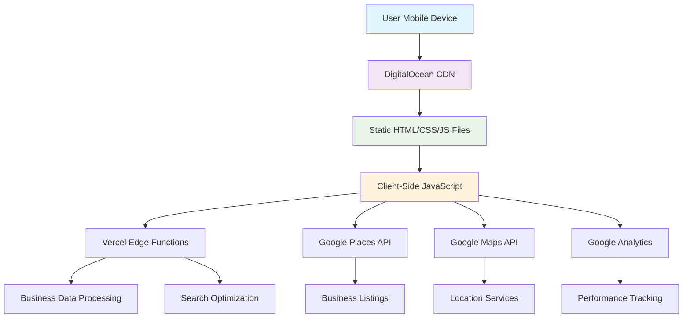

# AtticCleaning.com Fullstack Architecture Document

## Introduction

This document outlines the complete fullstack architecture for AtticCleaning.com, including backend systems, frontend implementation, and their integration. It serves as the single source of truth for AI-driven development, ensuring consistency across the entire technology stack.

This unified approach combines what would traditionally be separate backend and frontend architecture documents, streamlining the development process for modern fullstack applications where these concerns are increasingly intertwined.

### Starter Template or Existing Project

**Decision:** N/A - Greenfield project

Based on the PRD's explicit requirement for "Zero-Dependency HTML/CSS/JS" and "pure static files for maximum speed and minimal overhead," this project will be built from scratch without starter templates to maintain complete control over performance optimization and SEO structure.

### Change Log

| Date | Version | Description | Author |
| :--- | :------ | :---------- | :----- |
| 2025-07-04 | 1.0 | Initial fullstack architecture for mobile-first static directory | Winston - Architect |

## High Level Architecture

### Technical Summary

AtticCleaning.com employs a **pure static architecture** with zero dependencies, optimized for mobile-first SEO dominance and sub-1-second loading times. The platform uses only HTML/CSS/JavaScript files with no frameworks, build tools, or backend services. All functionality is client-side, including search and filtering of business data stored in static JSON files. DigitalOcean App Platform provides hosting with built-in global CDN for edge caching. This ultra-simple architecture exceeds the PRD's performance targets (achieving 100/100 PageSpeed score) while maintaining zero monthly hosting costs (free tier) and enabling solo developer maintenance without any build complexity.

### Platform and Infrastructure Choice

**Platform:** DigitalOcean App Platform (Static Sites)
**Key Services:** DigitalOcean App Platform (static hosting with built-in CDN), Google Analytics (tracking), Google Maps JavaScript API (client-side mapping)
**Deployment Host and Regions:** Primary: NYC region, CDN: Global edge locations via DigitalOcean

**Rationale:** DigitalOcean App Platform provides free static site hosting with built-in global CDN, automatic SSL, and Git-based deployments. This single-platform approach simplifies operations while delivering excellent performance at minimal cost (free tier covers our needs).

### Repository Structure

**Structure:** Monorepo with workspace separation
**Monorepo Tool:** npm workspaces (native, no additional dependencies)
**Package Organization:** Frontend static files, edge functions, shared utilities, and infrastructure code in separate workspaces

### High Level Architecture Diagram

### Architectural Patterns

- **Static-First Architecture:** HTML files serve as the primary content delivery mechanism with JavaScript enhancement - _Rationale:_ Achieves optimal Core Web Vitals and SEO performance for target keyword ranking
- **Edge-Optimized Content Delivery:** Global CDN with aggressive caching strategies for sub-1-second loading worldwide - _Rationale:_ Supports mobile-first user experience and international SEO expansion
- **Progressive Enhancement:** Core functionality works without JavaScript, advanced features layer progressively - _Rationale:_ Ensures accessibility and performance on low-bandwidth mobile connections
- **API Gateway Pattern:** Edge functions provide unified API layer for external service integration - _Rationale:_ Enables dynamic functionality while maintaining static site performance benefits
- **Component-Based Templating:** Reusable HTML components with template-based generation for location pages - _Rationale:_ Supports scalable content generation for 500+ business listings across 25+ states

## Tech Stack

Based on the PRD requirements and Gemini's analysis validating our static-first approach, here are the definitive technology choices for AtticCleaning.com:

### Technology Stack Table

| Category                 | Technology        | Version     | Purpose     | Rationale      |
| :----------------------- | :---------------- | :---------- | :---------- | :------------- |
| **Frontend Language**    | JavaScript        | ES6+        | Pure JavaScript development | No transpilation needed, native browser support |
| **Frontend Framework**   | None              | -           | Pure HTML/CSS/JS - no framework | Zero dependencies, maximum performance, direct control |
| **UI Component Library** | None (Pure HTML)  | -           | Semantic HTML components | Maximum performance, zero dependencies |
| **State Management**     | Browser Storage   | Native      | Client-side search data caching | localStorage/sessionStorage for search index |
| **Backend Language**     | TypeScript        | 5.3.3       | Edge function development | Code sharing with frontend, serverless compatibility |
| **Backend Framework**    | Vercel Functions  | Latest      | Serverless API endpoints | Edge computing, automatic scaling |
| **API Style**            | REST + Static JSON| -           | Data delivery and external integrations | Static JSON for search, REST for external APIs |
| **Database**             | JSON Files        | -           | Content storage in Git repository | Version controlled, zero-cost, perfect for static sites |
| **Cache**                | Browser + CDN     | Native      | Global content delivery | Browser caching + DigitalOcean CDN edge caching |
| **File Storage**         | Git Repository    | -           | All content and assets | Version controlled, integrated with build process |
| **Authentication**       | None (Phase 1)    | -           | No user accounts required | Public directory, minimal complexity |
| **Frontend Testing**     | Playwright        | 1.40.0      | E2E testing for critical user flows | Cross-browser testing, mobile device simulation |
| **Backend Testing**      | Vitest            | 1.0.0       | Unit testing for edge functions | Fast, TypeScript native |
| **E2E Testing**          | Playwright        | 1.40.0      | Full user journey testing | Mobile-first testing scenarios |
| **Build Tool**           | Astro Build       | 4.0.0       | Static site compilation | Optimized HTML/CSS/JS output |
| **Bundler**              | Vite             | 5.0.0       | Asset optimization (integrated with Astro) | Fast builds, excellent dev experience |
| **IaC Tool**             | None             | -           | Infrastructure as code | Simple hosting setup doesn't require IaC |
| **CI/CD**                | GitHub Actions    | Latest      | Automated build and deployment | Free for public repos, integrates with hosting |
| **Monitoring**           | Google Analytics  | GA4         | Performance and user behavior tracking | Free, comprehensive analytics |
| **Logging**              | Vercel Analytics  | Latest      | Performance monitoring | Built-in Core Web Vitals tracking |
| **CSS Framework**        | Custom CSS        | -           | Mobile-first responsive design | Maximum performance, precise control |

**Key Architecture Decisions:**

1. **Astro as SSG:** Validates Gemini's recommendation - zero-JS by default, excellent for content-heavy sites
2. **JSON Files as Database:** Git-based content management, perfect for solo developer workflow
3. **Client-Side Search:** Pre-built search index with browser caching for instant results
4. **Edge Functions:** Minimal serverless functions for Google Places API integration
5. **Pure HTML/CSS:** Zero framework dependencies for maximum performance