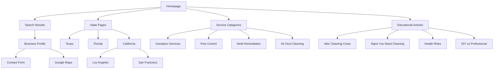
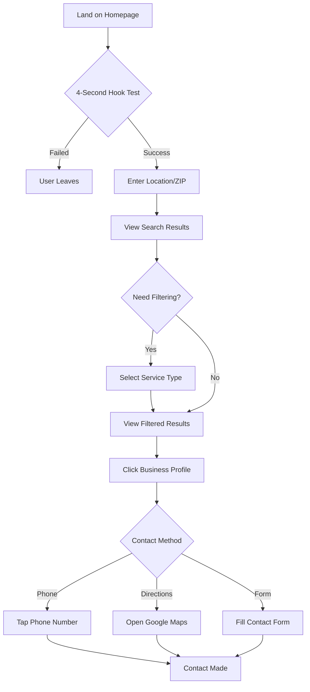
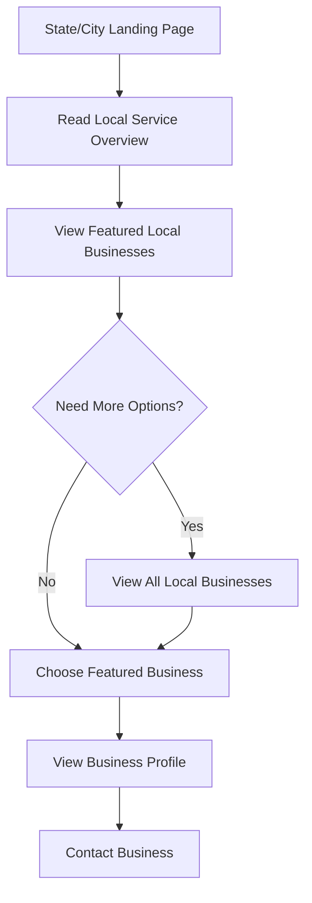

# AtticCleaning.com UI/UX Specification

## Introduction

This document defines the user experience goals, information architecture, user flows, and visual design specifications for AtticCleaning.com's user interface. It serves as the foundation for visual design and frontend development, ensuring a cohesive and user-centered experience optimized for mobile-first SEO dominance and the #1 ranking for "attic cleaning" keyword.

### Overall UX Goals & Principles

### Target User Personas

**Primary Homeowner (Mobile Search):** Homeowners with attic problems searching "attic cleaning" or "attic cleaning near me" on mobile devices. Typically time-pressured, need immediate solutions, and prefer phone contact. Age 35-65, concerned about health and safety, value professional expertise.

**Secondary Research User (Desktop):** Homeowners researching attic issues before contacting professionals. Consume educational content, compare multiple providers, and investigate costs. More methodical decision-making process but still convert through mobile contact.

**Attic Service Business Owner:** Professionals seeking listing opportunities and lead generation. Need clear service categorization, competitive pricing, and efficient lead management systems.

### Usability Goals

- **4-Second Hook:** New users must understand value proposition and available services within 4 seconds of page load
- **2-Minute Decision Window:** Users can evaluate, filter, and contact businesses within 2 minutes maximum
- **Mobile-First Contact:** One-tap phone calls and directions from business listings without form friction
- **Instant Search Results:** Location and service filtering provides immediate visual feedback without loading states
- **Sub-2-Second Loading:** All critical content renders within 2 seconds on 3G mobile connections

### Design Principles

1. **Speed Above All** - Every design decision prioritizes mobile loading speed and Core Web Vitals performance
2. **Trust Through Simplicity** - Clean, professional design builds confidence for health-sensitive attic services
3. **Mobile-First Contact** - Phone calls and directions are primary actions, forms are secondary
4. **SEO-Driven Content Hierarchy** - Above-the-fold content targets primary keywords with strategic placement
5. **Progressive Enhancement** - Core functionality works without JavaScript, enhancements layer progressively

### Change Log

| Date | Version | Description | Author |
| :--- | :------ | :---------- | :----- |
| 2025-07-04 | 1.0 | Initial UI/UX specification for mobile-first AtticCleaning.com | UX Expert |

## Information Architecture (IA)

### Site Map / Screen Inventory



### Navigation Structure

**Primary Navigation:** Single-column mobile navigation with prominent search functionality, collapsible hamburger menu for secondary pages, sticky contact CTA header

**Secondary Navigation:** Footer links to legal pages, service categories, and major location pages. Breadcrumb navigation for location hierarchy (State > City > Business)

**Breadcrumb Strategy:** SEO-optimized breadcrumbs showing location hierarchy and service categories, enabling users to navigate up the location tree easily

## User Flows

### Homeowner Search and Contact Flow

**User Goal:** Find and contact attic cleaning professionals in their area quickly

**Entry Points:** Google search "attic cleaning near me", direct website access, educational article internal links

**Success Criteria:** User contacts business within 2 minutes of landing on site

#### Flow Diagram



**Edge Cases & Error Handling:**

- No results in area: Show nearest businesses with distance, suggest expanding radius
- Location service denied: Provide manual ZIP/city input with clear instructions
- Slow internet: Progressive loading with skeleton screens, critical content first

**Notes:** Emphasize phone contact as primary CTA, minimize form friction

### Business Research and Comparison Flow

**User Goal:** Research multiple attic cleaning providers and compare services before contacting

**Entry Points:** Educational articles, specific service category pages, comparison searches

**Success Criteria:** User evaluates 2-3 businesses and initiates contact with preferred provider

#### Flow Diagram

```mermaid
graph TD
    Start[Educational Article] --> Learn[Read Problem/Solution Content]
    Learn --> CTA[Click "Find Local Pros"]
    CTA --> Search[Enter Location]
    Search --> Results[Browse All Results]
    Results --> Compare[Open Multiple Profiles]
    Compare --> Evaluate[Compare Services/Reviews]
    Evaluate --> Decision[Choose Preferred Business]
    Decision --> Contact[Initiate Contact]
```

**Edge Cases & Error Handling:**

- Information overload: Limit comparison to 3 profiles maximum, clear visual differentiation
- Decision paralysis: Highlight "most popular" or "best rated" options to guide choice
- Mobile multitasking: Support multiple profile tabs, quick navigation between comparisons

### Location-Based Landing Page Flow

**User Goal:** Find attic cleaning services specific to their city or state

**Entry Points:** Google search "[city] attic cleaning", state page navigation, internal linking

**Success Criteria:** User finds local businesses and initiates contact within location context

#### Flow Diagram



**Edge Cases & Error Handling:**

- Few local businesses: Show "serving your area" businesses from nearby regions
- No local content: Generate dynamic content based on business listings
- Outdated information: Implement last-updated timestamps and refresh schedules

## Wireframes & Mockups

**Primary Design Files:** Static HTML/CSS implementation with no external design tool dependency

### Key Screen Layouts

#### Mobile Homepage (320px-768px)

**Purpose:** Capture "attic cleaning" searches and convert to local searches within 4 seconds

**Key Elements:**

- Above-fold: H1 "Attic Cleaning Services Directory" with location search form
- Hero content: Problem/solution statement targeting homeowner pain points
- Trust signals: Service count, coverage area, recent activity indicators
- Featured locations: Major cities and states for internal linking
- Service categories: Visual icons for insulation, pest control, mold, air ducts

**Interaction Notes:** Single-column layout, large touch targets (44px minimum), immediate search feedback

#### Mobile Search Results (320px-768px)

**Purpose:** Display local businesses with instant contact options

**Key Elements:**

- Filter bar: Service type, distance radius, sort by rating/distance
- Business cards: Company name, rating, distance, primary services
- Contact CTAs: Large phone button, smaller directions button
- Service badges: Visual indicators for specializations and certifications
- Load more: Progressive loading of additional results

**Interaction Notes:** Card-based layout, swipe gestures for additional business info, sticky filter bar

#### Mobile Business Profile (320px-768px)

**Purpose:** Provide complete business information and multiple contact methods

**Key Elements:**

- Business header: Name, rating, distance, service badges
- Contact section: Large phone CTA, directions, website link, hours
- Services list: Detailed service descriptions and specializations
- Reviews section: Highlighted positive reviews with full review link
- Google Maps embed: Interactive map with location pin and street view access

**Interaction Notes:** Sticky contact header, expandable sections, tap-to-call optimization

#### Desktop Homepage (768px+)

**Purpose:** Progressive enhancement of mobile experience with richer content

**Key Elements:**

- Two-column layout: Hero content left, featured businesses/locations right
- Expanded navigation: Horizontal menu with service categories
- Enhanced search: Autocomplete, radius selector, advanced filters
- Content sections: Educational article previews, service explanations
- Footer enhancement: Comprehensive site navigation and legal links

**Interaction Notes:** Hover states, expanded content areas, keyboard navigation support

## Component Library / Design System

**Design System Approach:** Minimal custom component library using semantic HTML and progressive enhancement, no external framework dependencies

### Core Components

#### Search Form Component

**Purpose:** Primary user entry point for location-based business discovery

**Variants:** Homepage (prominent), Header (compact), Results page (persistent)

**States:** Default, Active (focused), Loading (search in progress), Error (no results)

**Usage Guidelines:**

- Always include location placeholder text "Enter city, state, or ZIP"
- Provide immediate feedback during typing with loading indicators
- Support both click/tap and enter key submission

#### Business Card Component

**Purpose:** Display business summary information in search results and listings

**Variants:** List view (vertical), Grid view (square), Featured (enlarged)

**States:** Default, Hover (desktop), Loading (skeleton), Offline (cached)

**Usage Guidelines:**

- Phone number must be most prominent CTA with tel: link
- Include distance only when location context is available
- Limit service tags to 3 maximum to prevent visual clutter

#### Contact CTA Component

**Purpose:** Primary conversion element for business contact actions

**Variants:** Phone (primary), Directions (secondary), Website (tertiary), Form (last resort)

**States:** Default, Active, Disabled (business closed), Loading (form submission)

**Usage Guidelines:**

- Phone CTA uses brand primary color and largest touch target
- Include business hours context for contact timing
- Form CTA only appears when other methods are insufficient

#### Filter Component

**Purpose:** Enable users to refine business search results by service type and location

**Variants:** Horizontal chips (mobile), Vertical list (desktop), Dropdown (compact)

**States:** Inactive, Active (selected), Disabled (no results), Clear (reset option)

**Usage Guidelines:**

- Limit simultaneous filter selections to prevent null results
- Provide clear visual indication of active filters
- Include result count updates with each filter change

## Branding & Style Guide

### Visual Identity

**Brand Guidelines:** Trust-focused professional design emphasizing speed, cleanliness, and local expertise

### Color Palette

| Color Type    | Hex Code | Usage                                    |
| :------------ | :------- | :--------------------------------------- |
| **Primary**   | #2563eb  | Phone CTAs, primary buttons, key links  |
| **Secondary** | #10b981  | Success states, positive indicators      |
| **Accent**    | #f59e0b  | Attention elements, featured badges      |
| **Success**   | #10b981  | Positive feedback, confirmations         |
| **Warning**   | #f59e0b  | Cautions, important notices             |
| **Error**     | #ef4444  | Errors, unavailable services            |
| **Neutral**   | #6b7280  | Text, borders, backgrounds              |

### Typography

**Font Families:**

- **Primary:** system-ui, -apple-system, BlinkMacSystemFont, 'Segoe UI', Roboto, sans-serif
- **Secondary:** Georgia, 'Times New Roman', serif (for article content)
- **Monospace:** 'SF Mono', Monaco, 'Cascadia Code', monospace

**Type Scale:**
| Element | Size | Weight | Line Height |
|:--------|:-----|:-------|:------------|
| H1 | 2rem (32px) | 700 | 1.2 |
| H2 | 1.5rem (24px) | 600 | 1.3 |
| H3 | 1.25rem (20px) | 600 | 1.4 |
| Body | 1rem (16px) | 400 | 1.6 |
| Small | 0.875rem (14px) | 400 | 1.5 |

### Iconography

**Icon Library:** Heroicons (optimized SVG subset), system emoji for service categories

**Usage Guidelines:** 24px standard size, 20px for compact layouts, inline SVG for performance

### Spacing & Layout

**Grid System:** CSS Grid with mobile-first breakpoints, single-column mobile, multi-column desktop

**Spacing Scale:** 4px base unit (0.25rem), increments of 4px up to 64px maximum

## Accessibility Requirements

### Compliance Target

**Standard:** WCAG 2.1 AA compliance with mobile-first accessibility implementation

### Key Requirements

**Visual:**

- Color contrast ratios: 4.5:1 for normal text, 3:1 for large text, 7:1 for enhanced
- Focus indicators: 2px blue outline with sufficient contrast for touch and keyboard users
- Text sizing: Minimum 16px base size, support for 200% zoom without horizontal scrolling

**Interaction:**

- Keyboard navigation: Full site functionality without mouse, logical tab order
- Screen reader support: Semantic HTML, proper heading hierarchy, descriptive link text
- Touch targets: Minimum 44px touch targets with adequate spacing

**Content:**

- Alternative text: Descriptive alt text for all images, empty alt for decorative elements
- Heading structure: Logical H1-H6 hierarchy, single H1 per page
- Form labels: Associated labels for all form controls, error message associations

### Testing Strategy

Manual testing with VoiceOver/TalkBack, keyboard-only navigation, automated accessibility scanning with axe-core

## Responsiveness Strategy

### Breakpoints

| Breakpoint | Min Width | Max Width | Target Devices           |
| :--------- | :-------- | :-------- | :----------------------- |
| Mobile     | 320px     | 767px     | iPhone SE, small phones  |
| Tablet     | 768px     | 1023px    | iPad, Android tablets    |
| Desktop    | 1024px    | 1439px    | Laptops, small desktops  |
| Wide       | 1440px    | -         | Large monitors, 4K       |

### Adaptation Patterns

**Layout Changes:** Single-column mobile to multi-column desktop, sidebar appearance on larger screens

**Navigation Changes:** Hamburger menu on mobile to horizontal navigation on desktop

**Content Priority:** Most important content first on mobile, secondary content appears on larger screens

**Interaction Changes:** Touch-optimized targets on mobile, hover states and keyboard shortcuts on desktop

## Animation & Micro-interactions

### Motion Principles

Subtle, purposeful animations that enhance usability without impacting performance. Respect prefers-reduced-motion for accessibility.

### Key Animations

- **Search Loading:** Subtle pulse animation on search button (Duration: 1s, Easing: ease-in-out)
- **Filter Updates:** Smooth height transitions for result updates (Duration: 0.3s, Easing: ease-out)
- **Business Card Hover:** Gentle lift effect on desktop (Duration: 0.2s, Easing: ease-out)
- **CTA Button Press:** Quick scale feedback on touch (Duration: 0.1s, Easing: ease-in)

## Performance Considerations

### Performance Goals

- **Page Load:** First Contentful Paint under 1.5 seconds on 3G mobile connections
- **Interaction Response:** Touch feedback within 16ms, visual updates within 100ms
- **Animation FPS:** Maintain 60fps for all animations, degrade gracefully on slower devices

### Design Strategies

Critical CSS inlined in HTML head, progressive image loading with WebP format, minimal JavaScript for core functionality, aggressive browser caching with service worker implementation

## Next Steps

### Immediate Actions

1. Create mobile-first HTML prototypes for homepage and search results
2. Implement Core Web Vitals monitoring and optimization
3. Conduct mobile usability testing with target homeowner demographics

### Design Handoff Checklist

- [x] All user flows documented with mobile-first approach
- [x] Component inventory complete with performance considerations
- [x] Accessibility requirements defined for mobile interactions
- [x] Responsive strategy clear with mobile-first breakpoints
- [x] Brand guidelines incorporated with speed optimization
- [x] Performance goals established with Core Web Vitals targets